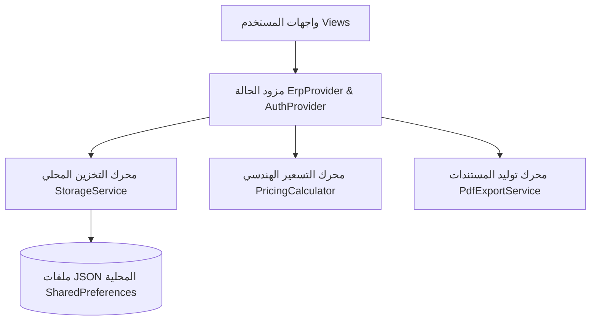

# 📘 نظام مطبعة ERP المتكامل لإدارة المطابع وعمليات الطباعة والتسعير
> **الدليل الشامل والمخطط المرجعي للنظام (System Architecture & Operations Manual)**  
> **الإصدار:** 2.5.0  
> **تاريخ التحديث:** سبتمبر 2026  
> **تطوير:** م. محمد رعدان (775420410)

---

## 📑 فهرس المحتويات
1. [نظرة عامة على النظام](#1-نظرة-عامة-على-النظام)
2. [المعمارية التقنية وحزمة البرمجيات](#2-المعمارية-التقنية-وحزمة-البرمجيات)
3. [نظام الأمان وتعدد المستخدمين والصلاحيات](#3-نظام-الأمان-وتعدد-المستخدمين-والصلاحيات)
4. [محرك التسعير الحي والهندسة الحسابية](#4-محرك-التسعير-الحي-والهندسة-الحسابية)
5. [إدارة عروض الأسعار ونظام الـ PDF](#5-إدارة-عروض-الأسعار-ونظام-الـ-pdf)
6. [أوامر الإنتاج ومتابعة التشغيل الصناعي](#6-أوامر-الإنتاج-ومتابعة-التشغيل-الصناعي)
7. [إدارة العملاء ودفاتر الحسابات والذمم](#7-إدارة-العملاء-ودفاتر-الحسابات-والذمم)
8. [سندات القبض والتحصيلات المالية](#8-سندات-القبض-والتحصيلات-المالية)
9. [قاعدة الورق والمخزون وحركات المستودع](#9-قاعدة-الورق-والمخزون-وحركات-المستودع)
10. [إدارة أسعار الخامات وتكاليف التشغيل](#10-إدارة-أسعار-الخامات-وتكاليف-التشغيل)
11. [لوحة المؤشرات والتقارير المالية والربحية](#11-لوحة-المؤشرات-والتقارير-المالية-والربحية)
12. [إعدادات النظام والنسخ الاحتياطي](#12-إعدادات-النظام-والنسخ-الاحتياطي)
13. [الهوية البصرية وتجربة المستخدم (UI/UX) ومربعات الحوار](#13-الهوية-البصرية-وتجربة-المستخدم-uiux-ومربعات-الحوار)
14. [دليل البناء وتثبيت ملفات APK](#14-دليل-البناء-وتثبيت-ملفات-apk)

---

## 1. نظرة عامة على النظام

نظام **مطبعة ERP** هو منصة برمجية متكاملة مصممة خصيصاً للمطابع التجارية ومطابع الأوفست والديجيتال ودور النشر، لتحويل العمليات اليومية من سجلات يدوية أو ملفات إكسل مبعثرة إلى منظومة برمجية مؤسسية محكمة تعمل دون الحاجة لاتصال بالإنترنت (Offline-First) وتتيح المزامنة والنسخ الاحتياطي بسهولة.

### الأهداف المحققة:
- **دقة هندسية 100% في التسعير:** احتساب تكاليف الأفرخ (100×70 سم)، الملازم (50×35 سم)، الهالك الصناعي، البليتات، وساعات تشغيل الماكينات.
- **إدارة كاملة للمقاسات بالسنتيمتر (سم):** إمكانية إدخال أي أبعاد للكتب والدفاتر مع توليد خوارزميات القص وتوزيع الصفحات آلياً.
- **حفظ الأرباح وضبط التدفقات المالية:** عزل صلاحيات التكاليف والأسعار عن الموظفين العاديين وحصرها بالمدير المالي/الإداري.
- **متابعة حية للمخزون:** خفض الهدر وتنبيه فوري عند وصول خامات الورق لحد إعادة الطلب.

---

## 2. المعمارية التقنية وحزمة البرمجيات

تم بناء النظام وفق أفضل الممارسات البرمجية لضمان السرعة، الخفة، والموثوقية العالية:

- **إطار العمل الأساسي:** Flutter 3.x / Dart (مع دعم كامل لـ Android، والكمبيوتر).
- **إدارة الحالة (State Management):** Provider Pattern لفصل منطق الأعمال (Business Logic) عن واجهات المستخدم.
- **التخزين وقواعد البيانات (Storage):** `SharedPreferences` مع محرك تسلسل JSON عالي الكفاءة (`StorageService`) مدمج مع تشفير للبيانات الحساسة.
- **توليد المستندات (PDF Rendering):** مكتبة `pdf` و `printing` لتوليد عروض أسعار وفواتير وسندات رسمية تدعم اللغة العربية والباركود و QR Code.
- **الأمان والتشفير:** مكتبة `crypto` بتشفير SHA-256 للرموز السرية.



---

## 3. نظام الأمان وتعدد المستخدمين والصلاحيات

يدعم النظام بيئة عمل تشاركية متعددة المستخدمين مع واجهة تسجيل دخول عصرية برمز مرور PIN رقمي:

### أدوار المستخدمين (User Roles):
1. **مدير النظام (Admin):**
   - صلاحية كاملة على كل شاشات النظام.
   - الوصول الحصري لشاشات: (إدارة الأسعار والتكاليف، تقارير الربحية، إعدادات النظام، وإدارة المستخدمين).
2. **الموظف / فني التشغيل (Staff):**
   - الوصول للشاشات التشغيلية فقط: (حاسبة الأسعار، عروض الأسعار، أوامر الإنتاج، العملاء، المدفوعات، ومخزون الورق).
   - حجب تكاليف الماكينات وهامش الربح الحقيقي.

### آليات الأمان المطبقة:
- **تشفير الـ PIN:** تشفير الرمز بواسطة **SHA-256** قبل التخزين، ولا يمكن قراءة الرمز الأصلي من قاعدة البيانات.
- **الحماية من التخمين:** إيقاف المحاولات وقفل تسجيل الدخول مؤقتاً لمدة **60 ثانية** تلقائياً عند إدخال الرمز خطأ 3 مرات متتالية.
- **إدارة الجلسة الدائمة:** حفظ جلسة المستخدم المسجل للدخول السريع مع إمكانية تسجيل الخروج الآمن بنقرة واحدة من القائمة الجانبية.

---

## 4. محرك التسعير الحي والهندسة الحسابية

قلب النظام النابض الذي يحل محل أعقد معادلات الإكسل عبر محاكاة هندسية حقيقية:

### المنتجات المدعومة:
1. **الكتب والمجلات (Book Printing):**
   - تحديد المقاس بالسنتيمتر (سم) بحرية تامة (مثال: `17×12 سم` أو `20×14 سم` أو المقاسات القياسية `A5`, `A4`).
   - خوارزمية ذكية لاحتساب عدد صفحات الملزمة (Signatures) من أبعاد الفرخ 50×35 سم مع مراعاة هوامش القص.
   - احتساب عدد أغلفة الكتب في الفرخ 100×70 سم مع احتساب كعب الكتاب (Spine) بناءً على سماكة الورق وعدد الصفحات.
2. **سندات ودفاتر الفواتير (NCR):**
   - دعم كامل للمقاسات بالسنتيمتر وحساب أطقم الدفتر في الفرخ 50×35 سم تلقائياً.
   - احتساب النسخ المكربنة (أصل + صورة، أصل + صورتين، أصل + 3 صور).
3. **البروشورات والفلايرات (Flyers):**
   - وجه واحد أو وجهين، وتحديد مسار الطي والقص.
4. **الفولدرات والعلب والكرتون (Packaging & Folders):**
   - احتساب مساحة التكسير، الفورمات، وتكلفة بليتات القص (Die-cutting).

### مكونات التكلفة المحتسبة آلياً:
$$\text{التكلفة الكلية} = \text{تكلفة الورق الخام} + \text{تكلفة بليتات الماكينة} + \text{أجرة تشغيل الماكينة} + \text{تكلفة السلوفان/التجليد} + \text{الهالك الصناعي}$$

---

## 5. إدارة عروض الأسعار ونظام الـ PDF

دورة حياة متكاملة لعرض السعر من الحساب وحتى التعاقد:

- **الحالات المعتمدة:** (مسودة Draft ➔ تم الإرسال Sent ➔ معتمد Approved ➔ ملغي Rejected).
- **التشغيل الآلي للأوامر:** عند تحويل حالة العرض إلى **معتمد**، يقوم النظام فوراً بإنشاء **أمر إنتاج** مطابق تلقائياً وإدراجه في خط الإنتاج.
- **مستندات PDF الرسمية:**
  - ترويسة وشعار المنشأة وبيانات الاتصال والضريبة.
  - جدول تفصيلي للمواصفات والخامات والتكلفة وسعر الوحدة والقيمة الإجمالية.
  - باركود ورمز QR معتمد للفحص والمطابقة.
  - أزرار مباشرة في التطبيق لـ: **طباعة مباشرة** أو **مشاركة عبر واتساب والإيميل**.

---

## 6. أوامر الإنتاج ومتابعة التشغيل الصناعي

لوحة تحكم تنفيذية لمتابعة حركة العمل داخل صالة الطباعة:

- **تتبع مراحل التنفيذ:** (جديد New ➔ قيد التجهيز ➔ قيد الطباعة Printing ➔ التشطيب والتجليد ➔ مكتمل جاهز للتسليم).
- **حساب الأفرخ وساعات التشغيل:** تسجيل عدد أفرخ الورق المصروفة وساعات عمل الماكينة بدقة لكل أمر تشغيل.
- **فلترة سريعة:** فرز الأوامر حسب الحالة أو العميل أو الماكينة المخصصة للعمل.

---

## 7. إدارة العملاء ودفاتر الحسابات والذمم

دليل شامل لحسابات العملاء والديون والمستحقات:

- **بطاقة العميل:** الاسم، كود العميل التلقائي (`C-0001`)، الهاتف، العنوان، والرصيد الحالي.
- **كشف حساب تفصيلي:** سجل الحركات المالية لكل عميل (عروض أسعار معتمدة مدينة + سندات قبض دائنة + رصيد لحظي).
- **تنبيهات الذمم:** تمييز العملاء المدينين للمطبعة تلقائياً بلون تنبيهي بارز.

---

## 8. سندات القبض والتحصيلات المالية

توثيق دقيق لكل مبالغ التحصيل المالي الواردة:

- **طرق القبض المدعومة:** نقدي، تحويل بنكي / صرافة، شيك، أو تسوية آجلة.
- **التأثير المحاسبي الفوري:** بمجرد حفظ سند القبض، يتم خصم المبلغ من مديونية العميل وتحديث كشف حسابه فوراً.
- **رقم مرجعي وملاحظات:** تسجيل رقم الحوالة أو الشيك وتاريخ الاستحقاق.

---

## 9. قاعدة الورق والمخزون وحركات المستودع

إدارة مخزنية متقدمة تضمن عدم توقف الإنتاج:

- **بطاقات الأصناف (Item Cards):** تفصيل نوع الخامة، الجرام (GSM)، المقاس القياسي، ملازم الفرخ، الرصيد الحالي، وسعر الشراء.
- **حركات المخزون الثلاثية:**
  - **دخول (شراء / توريد):** زيادة رصيد المخزن ومتوسط التكلفة.
  - **خروج (صرف للإنتاج / هالك):** تخفيض الرصيد مع ربط برقم أمر الإنتاج.
  - **تسوية (جرد دوري):** مطابقة الرصيد الدفتري بالرصيد الفعلي.
- **نظام التنبيه المبكر (Low Stock Alert):** بطاقات ملونة تبرز الأصناف التي انخفض رصيدها عن حد إعادة الطلب المحدد.
- **بطاقات متجاوبة للجوال (Mobile Cards):** تتيح للمستخدم قراءة تفاصيل الورق بسلاسة دون الحاجة للجدول العريض المقتطع.

---

## 10. إدارة أسعار الخامات وتكاليف التشغيل

لوحة تحكم مركزية (خاصة بالإدارة) لتحديد أسعار السوق وثوابت التكلفة:

- **أسعار الماكينات:** تحديد تكلفة ساعة التشغيل والسرعة في الساعة ونسبة الهالك الافتراضية لكل ماكينة.
- **تكاليف البليتات:** سعر البليت المنفرد ومقاساته لكل ماكينة.
- **الخامات الإضافية:** أسعار السلوفان (لامع / مطفي)، التجليد (غراء حراري، سلك، دبابيس)، والتكسير.
- **هوامش الربح:** ضبط نسب الربح المستهدفة حسب نوع المنتجات وحجم الطلبيات.

---

## 11. لوحة المؤشرات والتقارير المالية والربحية

لوحة قيادية تنفيذية تعكس الأداء المالي للمنشأة بلغة محاسبية واضحة:

### بطاقات الـ KPIs الرئيسية:
1. **إجمالي المبيعات المعتمدة:** حجم الإيرادات المؤكدة من عروض الأسعار المقبولة.
2. **التكاليف التشغيلية الكلية:** تكاليف الورق والبليتات والتشغيل المستهلكة فعلياً.
3. **صافي الربح المحقق:** الفارق الصافي بين الإيراد والتكلفة مع إظهار متوسط هامش الربح `%`.
4. **إجمالي قيمة المخزون:** رأس المال المستثمر في الورق والأحبار الجاهزة في المستودع.

### التحليلات المعمقة:
- **تحليل الربحية حسب المنتجات:** أشرطة تقدم بصرية توضح مساهمة كل منتج في الأرباح مع شارات الهوامش.
- **كفاءة الماكينات:** إجمالي ساعات التشغيل المحققة ونسب الهالك الصناعي ومعدلات الإنتاجية.

---

## 12. إعدادات النظام والنسخ الاحتياطي

- **هوية المنشأة:** اسم المطبعة، الهاتف، العنوان، الرقم الضريبي، وشروط عروض الأسعار التي تطبع في تذييل الـ PDF.
- **العملة والضرائب:** إمكانية تغيير عملة النظام بسهولة (ريال يمني، ريال سعودي، دولار...) وضبط نسبة ضريبة القيمة المضافة.
- **النسخ الاحتياطي والأمان:**
  - **تصدير قاعدة البيانات:** تصدير كافة بيانات النظام في ملف JSON مشفر ومضغوط وحفظه في الجهاز أو مشاركته.
  - **استيراد قاعدة البيانات:** استرجاع البيانات بأمان تام عند تغيير الهاتف أو إعادة التثبيت.
- **بيانات المطور والدعم الفني:** تذييل خفيف ورسمي لطلب الاستشارات والدعم الفني (`تطوير: م/محمد رعدان • 775420410`).

---

## 13. الهوية البصرية وتجربة المستخدم (UI/UX) ومربعات الحوار

تم تصميم النظام بمعايير بصرية فائقة مستوحاة من أحدث أنظمة الـ ERP العالمية:

- **نظام الألوان الرسمي:**
  - **الأخضر الزمردي الداكن (Primary Emerald):** يعكس الاستقرار المالي والموثوقية (`#0F766E` / `#059669`).
  - **الخلفيات البيضاء النقية:** إلغاء الصبغات الرمادية المظلمة لـ Material 3 واعتماد بياض ناصع وتباين فائق.
  - **الذهب الداكن (Accent Gold):** للأرقام المميزة وشارات الحالات المكتملة.
- **القائمة الجانبية الذكية للجوال (Mobile Drawer):**
  - **معايرة العرض الذهبي:** ضبط عرض القائمة ليكون **70% فقط من عرض الشاشة (بحد أقصى 275dp)** بدلاً من حجب كامل الشاشة، مما يُبقي ثلث الشاشة ظاهراً ومظللاً في الخلفية لمنح المستخدم إدراكاً بصرياً واضحاً بأنه داخل قائمة جانبية منزلقة.
  - **ترويسة مدمجة وخفيفة:** دمج الشعار واسم المنشأة وحالة الاتصال وزر الإغلاق في شريط علوي أنيق بارتفاع منخفض لتوفير مساحة رأسية لكافة عناصر القائمة.
  - **تنظيم وترتيب العناصر:** مسافات مريحة وخطوط متناسقة تتيح استعراض كافة أقسام وتصنيفات النظام بأقل قدر من التمرير.
- **مربعات الحوار التنفيذية (Executive Dialogs):**
  - ترويسة فخمة مع شارة أيقونة دائرية مخصصة لكل عملية، عنوان رئيسي عريض، نص توضيحي فرعي، وزر إغلاق سريع `(✕)`.
  - حقول إدخال مدعمة بأيقونات داخلية ملونة لتسهيل الإدخال السريع.
  - أزرار إجراءات متوازنة وكاملة العرض (زر إلغاء بإطار خفيف + زر تأكيد ملون بأيقونة).
- **واجهة أوامر الإنتاج الذكية للجوال (Production Orders Mobile UI):**
  - **شبكة المؤشرات المضغوطة (2x2 Grid):** تحويل كروت الإحصائيات الأربعة (إجمالي الأوامر، معتمدة، قيد التشغيل، مكتملة) إلى شبكة ثنائية مدمجة على الهواتف الذكية مع أيقونات دلالية ملونة وخلفيات بيضاء نقية، مما خفّض الارتفاع الرأسي المستهلك من 720dp إلى ~150dp فقط دون إهدار للمساحة.
  - **كروت الأوامر المتجاوبة (Mobile Order Cards):** استبدال الجدول العريض المكون من 13 عموداً على شاشات الهواتف بكروت تفصيلية راقية تعرض رقم وتاريخ الأمر، حالة الاعتماد، اسم العميل، مواصفات الماكينة والورق وأفرخ الطباعة وساعات التشغيل.
  - **إجراءات الإنتاج المباشرة:** أزرار صرف الورق السريع من المخزون مع إشعار الحالة، إتمام وتغيير حالة الأمر، وزر حذف آمن مع نافذة تأكيد تنفيذية راقية.
- **أيقونة التطبيق الرسمية:**
  - تصميم ثلاثي الأبعاد فاخر يجمع سلندرات ماكينات الأوفست ومسار الورق بألوان الطباعة القياسية (CMYK) ولمسات كحلية وذهبية.
  - توليد كامل مقاسات الأيقونة لنظام أندرويد من `mdpi` وحتى `xxxhdpi`.

---

## 14. دليل البناء وتثبيت ملفات APK

تم إعداد وتجهيز ملف التثبيت المباشر بنسخة الإصدار الرسمية (Release APK):

### هوية التطبيق (App Identity):
- **معرّف التطبيق (Application ID):** `com.matbaa.erp`
- **الحزمة (Namespace):** `com.matbaa.erp`
- **الإصدار:** `2.5.0` (يُدار من `pubspec.yaml`)
- **اسم التطبيق الظاهر:** «مطبعة ERP»

### مسار ملف التثبيت:
```
build\app\outputs\flutter-apk\app-release.apk
```

### أوامر التحقق والبناء عبر Terminal:
```bash
# فحص سلامة الأكواد وخلوها من الأخطاء
flutter analyze

# بناء ملف APK للإنتاج بحجم مضغوط وأداء كامل
flutter build apk --release
```

### توقيع نسخة الإصدار (Release Signing):
يقوم ملف `android/app/build.gradle.kts` بقراءة بيانات التوقيع من الملف `android/key.properties` (مستثنى من المستودع):
- **عند وجود الملف:** يتم التوقيع بمفتاح الإصدار الرسمي (صالح للنشر على المتاجر).
- **عند غيابه:** fallback مؤقت على مفتاح debug حتى لا يتعطل البناء المحلي (غير صالح للنشر).

خطوات إنشاء مفتاح الإصدار (مرة واحدة فقط — يجب الاحتفاظ به بأمان ودون فقدان):
```bash
keytool -genkey -v -keystore ~/matbaa-erp-release.jks -keyalg RSA -keysize 2048 -validity 10000 -alias matbaa-erp
```

ثم إنشاء ملف `android/key.properties` بالمحتوى:
```properties
storePassword=<كلمة مرور المخزن>
keyPassword=<كلمة مرور المفتاح>
keyAlias=matbaa-erp
storeFile=<المسار الكامل لملف matbaa-erp-release.jks>
```

> ⚠️ لا يُرفع ملف `key.properties` أو ملفات `.jks` إلى المستودع إطلاقاً (مستثناة في `android/.gitignore`).

---

## 15. مستودع الكود المصدري (GitHub Repository)

تم ربط ومزامنة المشروع بالكامل مع مستودع GitHub خاص (Private Repository):

- **رابط المستودع:** [https://github.com/Mohammedradan/erp_printer](https://github.com/Mohammedradan/erp_printer)
- **مستوى الخصوصية:** `Private` (خاص ومحمي بالكامل)
- **الفرع الافتراضي:** `main`
- **الحساب المالك:** `Mohammedradan`

---

> **ملاحظة للمطورين والإدارة:**  
> يُحفظ هذا الملف في المستودع كمرجع رئيسي لكل التحديثات المستقبلية، ويتم تحديثه دورياً مع كل تعديل على بنية أو واجهات النظام.

