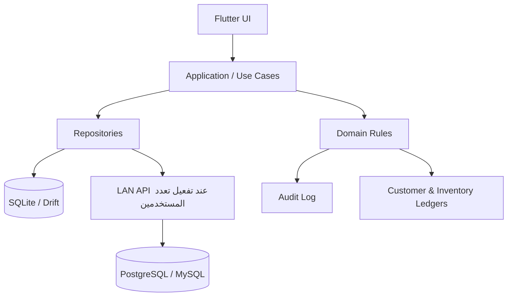

# تقرير تدقيق التطبيق وخطة التحسين
## نظام مطبعة ERP — المشاكل، الحلول، وأولويات التطوير

**تاريخ التقرير:** 2026-09-19
**نوع المراجعة:** مراجعة فنية ووظيفية للكود والتوثيق (Static Review)
**النطاق:** Flutter / Dart، منطق التسعير، المخزون، دورة عروض الأسعار والإنتاج، المستخدمون والصلاحيات، النسخ الاحتياطي، الاختبارات، وإعدادات إصدار Android.
**ملاحظة تحقق مهمة:** لم تُشغَّل أوامر `flutter analyze` و`flutter test` في بيئة المراجعة لأن Flutter/Dart غير متاحين فيها. لذلك يجب تنفيذ فحص التشغيل والاختبارات في بيئة تطوير Flutter قبل الإطلاق.

## حالة التنفيذ — 2026-09-19

**قرار النطاق المعتمد:** تنفيذ ضوابط P0 على النسخة المحلية الحالية مع الإبقاء مؤقتاً على `SharedPreferences`؛ لم يبدأ ترحيل SQLite/Drift أو LAN. كما بقيت معادلة نسبة الربح الحالية دون تغيير.

### المنجز

- أضيفت قائمة مواد محفوظة مع أمر الإنتاج (`ProductionMaterialRequirement`) ومتطلبات مواد في نتيجة التسعير؛ الكتاب يضم ورق المتن والغلاف، وNCR يضم كل طبقة ملونة.
- صرف أمر الإنتاج يتحقق من توفر جميع خاماته قبل الخصم ثم ينشئ حركة خروج مستقلة مرتبطة برقم الأمر لكل خامة.
- أصبحت حركات خروج الورق والحبر ترفض الرصيد السالب. لا تُحذف حركات المخزون؛ تنشأ حركة عكسية للحركات العادية، بينما تبقى التسويات وصرف الإنتاج للتصحيح/الإرجاع الموثق.
- اعتماد العرض يسجل قيد بيع واحداً وينشئ أمر إنتاج واحداً فقط. الإلغاء قبل الصرف ينشئ قيد عكس بيع ويلغي الأمر، ولا يمكن إعادة اعتماد العرض الملغي/المرفوض.
- أضيف دفتر قيود للعملاء، وترحيل محافظ للبيانات القديمة، وحفظه في النسخة الاحتياطية. كشف الحساب المرئي يعتمد على الدفتر حصراً.
- لا يمكن حذف العميل أو صنف الورق أو أمر الإنتاج إذا كانت له آثار تاريخية مرتبطة، ولا يمكن تعديل رصيد صنف ذي حركات مباشرةً بدلاً من حركة تسوية.
- أضيفت اختبارات تكامل لضوابط P0، كما عُدلت اختبارات الواجهة لتوفير `AuthProvider` وجلسة مدير.

### قيود ما زالت قائمة

- التخزين المحلي الحالي لا يقدم معاملات قاعدة بيانات حقيقية أو حماية تعارض عدة مستخدمين؛ ترحيل SQLite/Drift ما زال خطوة لاحقة لازمة قبل LAN.
- لا يوجد بعد إجراء **صرف استثنائي بعجز** خاص بالمدير؛ السلوك الحالي أكثر تحفظاً ويمنع العجز كلياً.
- لم يتم تنفيذ حجز المواد، وإرجاع الفائض، والهالك الفعلي بعد الإنتاج؛ وهي امتدادات تشغيلية لاحقة.
- لم يكتمل تحقق compiler أو الاختبارات في هذه البيئة لغياب Flutter/Dart.

---

## 1. الملخص التنفيذي

التطبيق يملك أساساً تجارياً قوياً جداً لأنه مبني حول سير عمل المطبعة فعلياً، وليس مجرد تطبيق فواتير عام. يغطي النظام التسعير، عروض الأسعار، أوامر الإنتاج، الورق والأحبار، العملاء، التحصيلات، التقارير، والمستندات PDF العربية.

**التقييم العام:**

| جانب التقييم | الوضع الحالي | التقدير |
|---|---|---|
| ملاءمة احتياجات المطبعة | قوي ومخصص للمجال | ممتاز |
| تجربة المستخدم العربية والجوال | واضحة واحترافية | ممتاز |
| محرك التسعير | جيد ومفصل وقابل للتطوير | جيد جداً |
| سلامة المخزون والقيود المالية | توجد مخاطر في الحالات المركبة | يحتاج معالجة عاجلة |
| الأمان والصلاحيات | بداية جيدة، لكن ليست حماية مؤسسية بعد | يحتاج تقوية |
| تعدد المستخدمين عبر LAN | غير مطبق فعلياً حالياً | غير جاهز |
| جاهزية النشر الرسمي | إعدادات افتراضية موجودة | غير جاهز قبل تجهيز الإصدار |

**الخلاصة:** التطبيق مناسب كنموذج أولي متقدم أو نظام يعمل على جهاز واحد. قبل الاعتماد عليه في العمليات المالية والإنتاجية اليومية لمطبعة، يجب تنفيذ عناصر الأولوية الحرجة (P0) المتعلقة بالمخزون، الاعتماد المالي، وقاعدة البيانات.

---

## 2. نقاط القوة التي يجب الحفاظ عليها

1. **فهم واضح لمجال المطابع:** دورة العمل مترابطة من التسعير حتى التحصيل والتقارير.
2. **دعم منتجات مطبعية متنوعة:** كتب، دفاتر NCR، كروت ومطبوعات فردية، تشطيبات وطباعات متعددة.
3. **تسعير قابل للتفسير:** محرك التسعير يعرض مراحل وتفاصيل الكلفة بدلاً من رقم نهائي فقط.
4. **تجربة عربية RTL:** الواجهات والرسائل والمصطلحات مناسبة للمستخدم العربي.
5. **دعم الجوال والكمبيوتر:** يوجد اهتمام بالقائمة الجانبية، بطاقات الجوال، والشاشات الواسعة.
6. **مستندات PDF عربية:** عروض الأسعار قابلة للطباعة والمشاركة.
7. **اختبارات موجودة فعلياً:** توجد اختبارات للتسعير، سير العمل، PDF، وأحجام الشاشات؛ وهي قاعدة ممتازة لتوسيع ضمان الجودة.
8. **توثيق وظيفي غني:** مجلد `matbaa-erp-docs` يوضح الرؤية، المتطلبات، وخطة التنفيذ.

---

## 3. سلم الأولويات

| الرمز | المعنى | أثره على العمل |
|---|---|---|
| **P0 — حرج** | يجب حله قبل اعتماد النظام مالياً أو إنتاجياً | قد ينتج رصيداً أو مالاً غير صحيح |
| **P1 — مرتفع** | ينفذ في أقرب نسخة بعد P0 | يؤثر على الأمان أو الاستقرار أو توسع الاستخدام |
| **P2 — مهم** | تحسين جودة وتجربة وإدارة النظام | لا يمنع الإطلاق المحدود |
| **P3 — تطوير مستقبلي** | ميزة توسعية أو تحسين غير عاجل | يرفع القيمة التجارية لاحقاً |

---

# 4. المشاكل والحلول المقترحة

## 4.1 المخزون متعدد الخامات لا يُصرف بدقة

| البند | التفاصيل |
|---|---|
| **الأولوية** | P0 — حرج |
| **الموقع التقني** | `lib/providers/erp_provider.dart`، خصوصاً إنشاء أمر الإنتاج و`deductPaperForOrder` |
| **المشكلة** | أمر الإنتاج يحتفظ بـ `paperId` واحد فقط، ثم يخصم كامل كمية الورق من هذا الصنف. |
| **الأثر** | في الكتاب يتم تجاهل ورق الغلاف أو خصمه من ورق المتن. وفي دفتر NCR متعدد الألوان يتم خصم إجمالي الأبيض والوردي والأصفر من صنف واحد غالباً. تصبح أرصدة المخزون والتقارير غير صحيحة. |

### الحل المقترح

إنشاء كيان جديد داخل أمر الإنتاج باسم مقترح: `ProductionMaterialRequirement`.

```text
ProductionMaterialRequirement
- id
- productionOrderId
- materialType: paper / ink / finishing
- inventoryItemId
- description
- quantityRequired
- wasteQuantity
- quantityIssued
- unit
- unitCostAtApproval
- status: planned / reserved / issued / returned
```

عند اعتماد عرض السعر:
1. تُنشأ متطلبات مستقلة لورق المتن، الغلاف، وكل لون NCR، وأي خامات إضافية.
2. عند الصرف، ينشئ النظام حركة مخزون مستقلة لكل مادة.
3. يحتفظ أمر الإنتاج بتكلفة المادة وقت الاعتماد، حتى لا تتغير تكلفة الأمر عند تعديل أسعار الورق لاحقاً.
4. تُتاح عملية إرجاع الفائض أو تسجيل الهالك الفعلي بعد الإنتاج.

### معايير القبول

- إنشاء كتاب بورق متن وغلاف يخصم من صنفين مختلفين.
- إنشاء NCR بثلاث طبقات يخصم من ثلاثة أصناف مختلفة.
- لا يمكن اعتبار الأمر “مصروفاً” ما لم تُصرف متطلباته وفق الكميات المعتمدة أو يُسجل استثناء معتمد.
- تقرير المخزون يظهر كل حركة مرتبطة برقم أمر الإنتاج.

---

## 4.2 يسمح النظام بالرصد السالب للمخزون

| البند | التفاصيل |
|---|---|
| **الأولوية** | P0 — حرج |
| **الموقع التقني** | `ErpProvider.addStockMove` و`ErpProvider.addInkMove` |
| **المشكلة** | عند حركة الخروج، يُطرح الرصيد مباشرة من دون تحقق من الكمية المتاحة. |
| **الأثر** | يمكن أن يظهر رصيد ورق أو حبر سالب، ويصبح قرار الشراء والإنتاج مبنياً على بيانات خاطئة. |

### الحل المقترح

- التحقق من الكمية قبل حركة الخروج.
- رفض الحركة عند عدم توفر الرصيد، مع رسالة تعرض المتاح والمطلوب والعجز.
- دعم خيار استثنائي للمدير فقط باسم **صرف استثنائي مع عجز**، مع سبب إلزامي وسجل تدقيق.
- إضافة حالة **محجوز** للمواد عند اعتماد أمر إنتاج، ثم تحويلها إلى **مصروف** عند بدء التشغيل.

### معايير القبول

- الموظف لا يستطيع صرف كمية أكبر من الرصيد المتاح.
- المدير لا يستطيع تجاوز الرصيد إلا بسبب مسجل.
- التقرير يفرق بين المتاح، المحجوز، المصروف، والعجز.

---

## 4.3 اعتماد العرض وإلغاؤه قد يكرر الأثر المالي والإنتاجي

| البند | التفاصيل |
|---|---|
| **الأولوية** | P0 — حرج |
| **الموقع التقني** | `ErpProvider.updateQuotationStatus` و`createProductionOrderFromQuote` |
| **المشكلة** | عند الانتقال إلى حالة “معتمد”، يضاف مبلغ البيع ويُنشأ أمر إنتاج. لا توجد حماية واضحة من إعادة الاعتماد بعد تغيير الحالة، ولا آلية عكس للقيد عند الإلغاء. |
| **الأثر** | احتمال تكرار المبيعات، أوامر الإنتاج، والذمم عند تغيير حالات العرض أكثر من مرة. |

### الحل المقترح

- تعريف انتقالات حالات رسمية لا تسمح بالتغييرات العشوائية:

```text
مسودة → مرسل → معتمد → قيد الإنتاج → مكتمل → مسلّم
                  ↘ ملغي
```

- ربط أمر الإنتاج بقاعدة فريدة على `quotationId` لمنع إنشاء أمرين لنفس العرض.
- عند إلغاء عرض معتمد: تنفيذ عملية **إلغاء اعتماد** موثقة تنشئ قيوداً عكسية ولا تحذف التاريخ.
- منع تعديل السعر/الكمية في العرض المعتمد؛ يُنشأ إصدار جديد أو ملحق بدلاً منه.

### معايير القبول

- لا يمكن إنشاء أكثر من أمر إنتاج واحد للعرض نفسه إلا بإجراء “إعادة تشغيل” صريح ومعتمد.
- لا تزيد ذمة العميل مرتين لنفس العرض.
- الإلغاء يترك أثراً واضحاً في سجل العمليات.

---

## 4.4 الذمم والتقارير تعتمد على حقول قابلة للتعديل بدلاً من دفتر قيود

| البند | التفاصيل |
|---|---|
| **الأولوية** | P0 — حرج |
| **الموقع التقني** | نموذج `Customer` وعمليات `_applyCustomerSale` و`recordPayment` |
| **المشكلة** | إجمالي مبيعات العميل والمدفوعات يتم تحديثهما مباشرة في بطاقة العميل. |
| **الأثر** | يمكن أن يخرج الرصيد عن الحقيقة بعد الإلغاء أو التعديل أو الاستيراد أو حدوث خطأ أثناء الحفظ. يصعب تدقيق مصدر أي رصيد. |

### الحل المقترح

بناء سجل حسابات عملاء غير قابل للحذف المباشر، باسم مقترح: `CustomerLedgerEntry`.

```text
CustomerLedgerEntry
- id
- customerId
- entryDate
- entryType: opening_balance / invoice_or_approved_quote / payment / credit_note / adjustment
- debit
- credit
- referenceType
- referenceId
- createdBy
- createdAt
- notes
```

ويحسب الرصيد من مجموع القيود، لا من حقل محفوظ يمكن تعديله يدوياً.

### معايير القبول

- كشف الحساب يبين كل مصدر للدين أو السداد.
- لا يمكن حذف سند قبض أو اعتماد عرض بعد استخدامه؛ بل ينشأ قيد عكسي.
- يمكن مطابقة رصيد العميل مع حركاته سطراً بسطر.

---

## 4.5 تسمية “هامش الربح” لا تطابق دائماً المعادلة المحاسبية

| البند | التفاصيل |
|---|---|
| **الأولوية** | P1 — مرتفع |
| **الموقع التقني** | `lib/services/pricing_engine_service.dart` |
| **المشكلة** | المعادلة الحالية تستخدم: `سعر البيع = التكلفة × (1 + النسبة)`، وهي زيادة على التكلفة (Markup) وليست هامش ربح من سعر البيع (Margin). |
| **الأثر** | إذا أدخل المدير 30% وهو يتوقع هامشاً فعلياً من سعر البيع، فإن الهامش الحقيقي سيكون أقل من 30%. |

### الحل المقترح

اتخاذ قرار واضح في الإعدادات:

1. **نسبة ربح على التكلفة (Markup):**
   ```text
   سعر البيع = التكلفة × (1 + النسبة)
   ```
2. **هامش ربح من سعر البيع (Margin):**
   ```text
   سعر البيع = التكلفة ÷ (1 - النسبة)
   ```

ويجب أن تعرض الواجهة اسم الخيار بوضوح، مع إظهار النسبتين في عرض السعر الداخلي للإدارة.

---

## 4.6 SharedPreferences ليست قاعدة بيانات ERP

| البند | التفاصيل |
|---|---|
| **الأولوية** | P0 للجهاز متعدد المستخدمين، P1 لجهاز واحد |
| **الموقع التقني** | `lib/services/storage_service.dart` |
| **المشكلة** | كل البيانات تُخزن كسلاسل JSON في `SharedPreferences`. |
| **الأثر** | لا توجد معاملات ذرية حقيقية، ولا علاقات مرجعية، ولا فهارس، ولا هجرة بيانات، ولا قدرة جيدة على التوسع أو منع تعارض عدة مستخدمين. |

### الحل المقترح

#### المرحلة المحلية
- اعتماد SQLite مع **Drift** أو طبقة بيانات مماثلة.
- تفعيل معاملات قاعدة البيانات عند: اعتماد العرض، إنشاء الأمر، صرف المواد، تسجيل السداد، والإلغاء.
- تعريف الجداول والعلاقات والمفاتيح الخارجية.
- تنفيذ Migrations مدروسة عند تحديث التطبيق.

#### مرحلة الشبكة المحلية LAN
- خادم API داخل المطبعة.
- قاعدة PostgreSQL أو MySQL مركزية.
- تطبيق Flutter يبقى واجهة عميل، ولا يصبح مصدر الحقيقة للبيانات.
- صلاحيات وتدقيق ومزامنة تنفذ في الخادم.

> لا يُنصح باستخدام التخزين المحلي الحالي كحل LAN متعدد المستخدمين؛ فهو لا يوفر المزامنة أو منع التعارض.

---

## 4.7 النسخ الاحتياطي غير مشفر ولا يصدّر ملفاً حقيقياً

| البند | التفاصيل |
|---|---|
| **الأولوية** | P1 — مرتفع |
| **الموقع التقني** | `StorageService.exportBackupJson` وواجهة الإعدادات |
| **المشكلة** | النسخة الحالية JSON عادي يُعرض في مربع حوار ويُنسخ إلى الحافظة. كما أنها لا تتضمن المستخدمين أو بيانات القفل ومحاولات الدخول. |
| **الأثر** | احتمال تسرب بيانات العملاء والأسعار، وصعوبة الحفظ والاستعادة للمستخدم العادي، وعدم توافق الوصف الحالي مع التنفيذ الفعلي. |

### الحل المقترح

- تصدير ملف بامتداد مثل `.matbaa-backup`.
- تشفير الملف بـ AES-GCM مع كلمة مرور النسخة الاحتياطية.
- تضمين: رقم الإصدار، تاريخ التصدير، checksum، الجداول المصدرة، وسياسة تصدير المستخدمين.
- تنفيذ استيراد آمن: التحقق أولاً ثم أخذ نسخة تلقائية من البيانات الحالية ثم الاستبدال داخل Transaction.
- دعم File Picker / Save Dialog بدلاً من الحافظة.
- تحديد سياسة واضحة: هل حسابات المستخدمين تُنقل؟ إن نُقلت، يجب ألا تُنقل الجلسات النشطة.

---

## 4.8 حماية PIN والصلاحيات تحتاج طبقة أقوى

| البند | التفاصيل |
|---|---|
| **الأولوية** | P1 — مرتفع |
| **الموقع التقني** | `AuthService` و`AuthProvider` و`MainLayout` |
| **المشكلة** | يستخدم PIN قصير مع SHA-256 فقط، والصلاحيات تُخفى أساساً في القائمة الجانبية. |
| **الأثر** | SHA-256 سريع لرمز من 4–6 أرقام عند الوصول إلى البيانات. وإخفاء شاشة من القائمة لا يكفي كضمان أمني في طبقة الأعمال. |

### الحل المقترح

1. استخدام KDF بملح فريد لكل مستخدم: PBKDF2 أو Argon2 أو bcrypt.
2. حفظ المفاتيح أو بيانات الجلسة الحساسة في `flutter_secure_storage`.
3. فرض الصلاحيات داخل Use Cases / Services وليس في الواجهة فقط.
4. إضافة سجل محاولات دخول وسجل عمليات المدير.
5. منع حذف آخر مدير نشط، ومنع الموظف من ترقية نفسه أو تعديل الدور دون صلاحية.
6. عند دعم LAN، تكون المصادقة والصلاحيات في الخادم لا في التطبيق فقط.

---

## 4.9 حالات المنتج والإنتاج تحتاج ضبطاً تشغيلياً أعمق

| البند | التفاصيل |
|---|---|
| **الأولوية** | P1 — مرتفع |
| **المشكلة** | حالات الأمر الأساسية موجودة، لكن لا يوجد تعريف كامل للتسليم الجزئي، مراقبة الجودة، المرتجعات، الهالك الفعلي، أو تغيير المواصفات بعد بدء الإنتاج. |

### الحل المقترح

اعتماد مسار تشغيلي مثل:

```text
معتمد → مجدول → محجوز مواد → مواد مصروفة → تحت الطباعة
→ تحت التشطيب → فحص جودة → جاهز للتسليم → مسلّم → مغلق
```

مع دعم الحالات الاستثنائية:

```text
معلق / متوقف / ملغي / معاد تشغيله / تسليم جزئي
```

ويجب أن تتضمن كل حركة: المستخدم، التاريخ، السبب، والحالة السابقة واللاحقة.

---

## 4.10 اختبارات الواجهة لا تهيئ جميع الـ Providers المطلوبة

| البند | التفاصيل |
|---|---|
| **الأولوية** | P1 — مرتفع |
| **الموقع التقني** | `test/widget_test.dart` و`test/overflow_test.dart` |
| **المشكلة** | هذه الاختبارات تضيف `ErpProvider` فقط، بينما `MatbaaErpApp` يستدعي `AuthProvider` أيضاً. |
| **الأثر** | يجب إصلاح إعداد الاختبار قبل أن تنجح اختبارات الواجهة؛ وإلا قد يظهر `ProviderNotFoundException`. |

### الحل المقترح

- بناء factory مشتركة للاختبارات تضيف `ErpProvider` و`AuthProvider` مع `AuthService` و`StorageService` الوهميين.
- إضافة مستخدم مدير افتراضي للاختبارات أو اختبار صريح لمسار الإعداد الأول.
- تشغيل التحليل والاختبارات في CI مع كل تعديل.

### حزمة اختبارات مقترحة

- اعتماد، إلغاء، وإعادة اعتماد العرض.
- منع تكرار أمر الإنتاج.
- خصم مواد كتاب متعدد الخامات.
- خصم NCR متعدد الألوان.
- منع الرصيد السالب.
- أرصدة العملاء من دفتر القيود.
- صلاحيات الموظف مقابل المدير.
- تصدير/استيراد النسخة الاحتياطية المشفرة.
- PDF بالعربية دون اتصال بالإنترنت.
- اختبار أداء على قاعدة بيانات كبيرة نسبياً.

---

## 4.11 ملفات كبيرة جداً وصعوبة صيانة متوقعة

| البند | التفاصيل |
|---|---|
| **الأولوية** | P2 — مهم |
| **المشكلة** | بعض ملفات الواجهات والخدمات كبيرة جداً، ومنها حاسبة التسعير والمخزون والعملاء وتسجيل الدخول. |
| **الأثر** | ارتفاع احتمال أخطاء التعديل، صعوبة إعادة الاستخدام، وصعوبة كتابة اختبارات دقيقة. |

### الحل المقترح

تقسيم كل وحدة إلى:

```text
features/
  pricing/
    presentation/
    application/
    domain/
    data/
  inventory/
  quotations/
  production/
  customers/
  authentication/
```

مثال لحاسبة التسعير:
- Widgets مستقلة لكل نوع منتج.
- ViewModel / Controller للحالة.
- Domain Service للحساب فقط.
- Repository للبيانات.
- Dialogs وCards وجداول منفصلة.

---

## 4.12 إنشاء PDF العربي يحتاج اختبار وضع عدم الاتصال

| البند | التفاصيل |
|---|---|
| **الأولوية** | P2 — مهم |
| **الموقع التقني** | `PdfExportService` يستخدم `PdfGoogleFonts.cairoRegular()` و`PdfGoogleFonts.cairoBold()` |
| **المشكلة المحتملة** | يجب التأكد أن الخط العربي متاح عند أول توليد PDF دون اتصال؛ التطبيق يعلن أنه Offline-First. |
| **الأثر** | قد يتعذر توليد PDF أو تتأثر الخطوط في جهاز لا يملك اتصالاً عند الاستخدام الأول. |

### الحل المقترح

- اختبار صريح لتوليد PDF في وضع الطيران / دون إنترنت.
- إن لم يكن السلوك مضموناً، تضمين خطوط Cairo مرخصة ضمن Assets وتحميلها محلياً.
- إضافة شعار المنشأة كـ Asset اختياري، وQR/باركود فقط إن كان لهما قيمة عملية مؤكدة.

---

## 4.13 إعدادات Android للإصدار ما زالت افتراضية

| البند | التفاصيل |
|---|---|
| **الأولوية** | P1 — مرتفع قبل النشر |
| **الموقع التقني** | `android/app/build.gradle.kts` و`AndroidManifest.xml` |
| **المشكلة** | اسم الحزمة ما زال `com.example.erp_printer`، وإصدار release مهيأ بمفتاح debug، مع وجود تعليقات TODO لإعداد signing حقيقي. |
| **الأثر** | لا ينبغي نشر التطبيق رسمياً أو تسليمه تجارياً بهذه الإعدادات. |

### الحل المقترح

1. اختيار package id نهائي مثل `com.mohammedradan.matbaa_erp` بعد التحقق من توفره.
2. إنشاء Keystore للإنتاج وحفظه خارج Git.
3. ضبط signingConfig للإصدار release باستخدام متغيرات بيئة أو ملف خصائص غير مرفوع للمستودع.
4. مراجعة رقم الإصدار واسم التطبيق والأيقونة وسياسة التحديث.
5. تنفيذ build APK/AAB تجريبي وتثبيته على جهاز فعلي.

---

## 4.14 التوثيق وREADME لا يعكسان حالة المنتج الحالية بالكامل

| البند | التفاصيل |
|---|---|
| **الأولوية** | P2 — مهم |
| **المشكلة** | `README.md` ما زال قالب Flutter افتراضياً، بينما توجد وثائق غنية في مجلد `matbaa-erp-docs`. توجد أيضاً عبارات في التوثيق عن تشفير ومزامنة LAN تحتاج أن تطابق التنفيذ الفعلي. |

### الحل المقترح

تحديث README ليشمل:
- تعريف المنتج والميزات الفعلية.
- المنصات المدعومة.
- طريقة التشغيل والبناء.
- طريقة الإعداد الأول والحساب الإداري.
- قيود النسخة الحالية: محلية/جهاز واحد إلى أن ينفذ الخادم.
- سياسة النسخ الاحتياطي.
- جدول الإصدارات والتغييرات.

---

# 5. تحسينات وظيفية مقترحة

## 5.1 إدارة الإنتاج

- تقويم وجدولة للماكينات حسب الساعات والطاقة اليومية.
- حجز الماكينة والمواد قبل بدء العمل.
- سجل هالك فعلي مقابل الهالك المقدر.
- تتبع تسليمات جزئية للعميل.
- فحص جودة مع سبب الرفض وإعادة التشغيل.
- ربط أمر الإنتاج بمرفقات: التصميم، ملف PDF، ملاحظات العميل، موافقة العميل.

## 5.2 إدارة المخزون

- وحدات قياس دقيقة: فرخ، ملزمة، رزمة، كرتون، كجم، لتر.
- تحويل وحدات مضبوط لكل صنف.
- متوسط تكلفة مرجح أو FIFO كسياسة واضحة للتكلفة.
- جرد دوري مع موافقة مدير على فروقات الجرد.
- حد إعادة طلب واقتراح أمر شراء.
- الموردون وفواتير الشراء وأوامر التوريد.

## 5.3 المالية والتقارير

- دفتر قيود العملاء كما ورد أعلاه.
- فواتير فعلية منفصلة عن عرض السعر.
- سندات قبض مرقمة وغير قابلة للحذف المباشر.
- تقارير: ربحية المنتج، العميل، الماكينة، الفترة، والفني.
- مقارنة التكلفة المعيارية بالتكلفة الفعلية بعد إغلاق أمر الإنتاج.
- تقرير عمر الذمم والمتأخرات.

## 5.4 تجربة المستخدم

- بحث شامل بالعميل، رقم العرض، رقم الأمر، والمنتج.
- فلاتر محفوظة للتقارير والمخزون.
- تنبيهات للمخزون المنخفض، أوامر متأخرة، وذمم مستحقة.
- اختصارات لوحة المفاتيح للكمبيوتر.
- دعم طباعة ملصقات أو باركود للورق والأوامر عند وجود حاجة تشغيلية.
- ترجمة دقيقة للمصطلحات المتداولة داخل المطبعة المستخدمة فعلياً.

---

# 6. التصميم المستهدف المقترح



## المبادئ الأساسية للتصميم المستهدف

1. **قاعدة البيانات هي مصدر الحقيقة**، وليست الواجهة أو Provider.
2. **كل حركة مؤثرة مالية أو مخزنية لها سجل غير قابل للحذف المباشر.**
3. **كل اعتماد أو إلغاء يتم داخل Transaction واحدة.**
4. **التقارير تُحسب من القيود والحركات، لا من حقول إجمالية قابلة للتعديل.**
5. **الصلاحية تُفرض في طبقة الأعمال والخادم عند استخدام الشبكة.**
6. **كل تغيير حساس له مستخدم وتاريخ وسبب.**

---

# 7. خارطة طريق التنفيذ

## المرحلة 0 — تثبيت الجودة الحالية

- تثبيت Flutter/Dart في بيئة التطوير.
- تشغيل `flutter analyze` و`flutter test`.
- إصلاح تهيئة Providers في اختبارات الواجهة.
- إنشاء CI لتشغيل التحليل والاختبارات على كل Pull Request.
- تحديث README وإعدادات الإصدار الأساسية.

**ناتج المرحلة:** نسخة قابلة للاختبار بثقة أعلى دون تغيير جذري في البنية.

## المرحلة 1 — سلامة المخزون والمال (P0)

- تنفيذ متطلبات المواد المتعددة في أوامر الإنتاج.
- منع الرصيد السالب وسياسة الاستثناء الإداري.
- منع تكرار أمر الإنتاج والمبيعات للعرض نفسه.
- إنشاء دفتر قيود العملاء وحركات مخزون قابلة للتدقيق.
- دعم إلغاء الاعتماد والقيود العكسية.

**ناتج المرحلة:** أرقام المخزون والذمم موثوقة للاستخدام التشغيلي.

## المرحلة 2 — قاعدة البيانات والنسخ الاحتياطي (P0/P1)

- ترحيل `SharedPreferences` إلى SQLite/Drift.
- تصميم migrations وحماية التكامل المرجعي.
- نسخ احتياطي مشفر كملف واستيراد آمن.
- اختبار ترحيل بيانات النسخة السابقة.

**ناتج المرحلة:** بيانات مستقرة وقابلة للنمو والاستعادة.

## المرحلة 3 — الأمان والصلاحيات (P1)

- تقوية PIN والتخزين الحساس.
- تطبيق سياسة أدوار وصلاحيات داخل الخدمات.
- سجل تدقيق للعمليات الحساسة.
- منع سيناريوهات خطرة: حذف آخر مدير، تعديل الذات بصلاحية أعلى، حذف سندات مرتبطة.

**ناتج المرحلة:** تحكم إداري وأمان مناسب للبيئة التشغيلية.

## المرحلة 4 — LAN وتعدد المستخدمين (P1/P3 بحسب الحاجة)

- اعتماد API داخلي وخادم مركزي.
- نقل المصادقة والصلاحيات إلى الخادم.
- حل التعارض والمزامنة وسجل العمليات.
- لوحة مراقبة للنسخ الاحتياطي وحالة الخادم.

**ناتج المرحلة:** تشغيل عدة أجهزة بأرقام موحدة وموثوقة.

## المرحلة 5 — تطويرات الأعمال والتقارير (P2/P3)

- الجرد والموردون والمشتريات.
- جدولة الماكينات.
- التسليم الجزئي ومراقبة الجودة.
- تقارير متقدمة ولوحات مؤشرات قابلة للتصدير.

---

# 8. قائمة تحقق قبل تسليم نسخة إنتاجية

## البيانات والعمليات

- [x] لا يمكن صرف مادة بمخزون سالب في العمليات العادية (إجراء الاستثناء الإداري لم ينفذ بعد).
- [x] كل أمر إنتاج جديد يحتفظ بقائمة مواده وكمياتها المعتمدة.
- [x] لا يتكرر أمر إنتاج أو قيد بيع لنفس العرض المعتمد.
- [x] توجد عملية إلغاء اعتماد موثقة مع قيد بيع عكسي قبل صرف المواد.
- [x] كشف حساب العميل مبني على دفتر قيود.
- [x] لا يمكن حذف حركة المخزون؛ تُنشأ حركة عكسية للحركات العادية، وتستخدم تسوية تصحيحية للتسويات وصرف الإنتاج.

## الأمان

- [ ] PIN محمي بخوارزمية مخصصة لكلمات المرور مع Salt.
- [ ] صلاحيات المدير والموظف مفروضة داخل الخدمات.
- [ ] يوجد سجل تدقيق للعمليات الحساسة.
- [ ] النسخ الاحتياطية مشفرة ومحمية بكلمة مرور.

## الجودة والإصدار

- [ ] `flutter analyze` يمر دون أخطاء حرجة.
- [ ] جميع الاختبارات تمر بنجاح، بما فيها اختبار الصلاحيات والمخزون متعدد الخامات.
- [ ] PDF العربي يعمل دون اتصال بالإنترنت على جهاز فعلي.
- [ ] Android package id وSigning Config رسميان وليسا افتراضيين.
- [ ] تم تجربة APK/AAB على أجهزة Android فعلية.
- [ ] README ودليل المستخدم يعكسان الميزات والقيود الحقيقية للنسخة.

---

# 9. قرارات تحتاج اعتماد صاحب المشروع

هذه القرارات تؤثر على شكل الحل ويجب تأكيدها قبل التنفيذ:

1. هل المقصود من “هامش الربح” هو نسبة على التكلفة أم هامش فعلي من سعر البيع؟
2. هل يعمل النظام حالياً على جهاز واحد أم يلزم LAN من النسخة القادمة؟
3. هل يمكن السماح بمخزون سالب في حالات طارئة؟ ومن يملك الصلاحية؟
4. ما هي سياسة تكلفة الورق: متوسط مرجح أم FIFO أم سعر ثابت؟
5. هل عرض السعر المعتمد يعتبر فاتورة، أم يجب إنشاء فاتورة منفصلة؟
6. ما سياسة إلغاء العرض أو أمر الإنتاج بعد بدء الصرف؟
7. هل يلزم رقم ضريبي وضريبة قيمة مضافة وفواتير قانونية؟
8. هل النسخة الاحتياطية يجب أن تشمل المستخدمين، أم تستثنيهم لأسباب أمنية؟
9. هل توجد حاجة لربط واتساب، طابعة حرارية، قارئ باركود، أو ميزان؟
10. ما هي وحدات المخزون المعتمدة لكل خامة داخل المطبعة؟
11. ما هي الماكينات الفعلية وقواعد الهالك والسحب لكل منها؟

---

## خاتمة

المشروع يمتلك ميزة تنافسية واضحة: **فهم واقعي لعمل المطبعة مع واجهة عربية مريحة ومحرك تسعير مفصل**. الأولوية الصحيحة في المرحلة القادمة ليست إضافة شاشات كثيرة، بل ضمان أن كل اعتماد أو صرف أو سداد ينتج بيانات صحيحة، قابلة للتدقيق، ولا تتكرر عند تغير الحالة أو تعدد المستخدمين.

بعد إنجاز عناصر P0 وP1، سيكون النظام مؤهلاً للانتقال من نموذج متقدم إلى منتج عملي قابل للاعتماد والتوسع.
